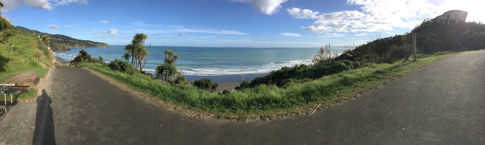

# MathAlternativeGradingMaterials

This is a demo for a future version of the 
[Alternative Grading Materials for Mathematics Courses ](https://drive.google.com/drive/folders/1GNSqfOb0LZS6BeAuc1tqPDZWKkPk11KT?usp=drive_link) 
repository.

# Raglan, New Zealand

I like to surf here.